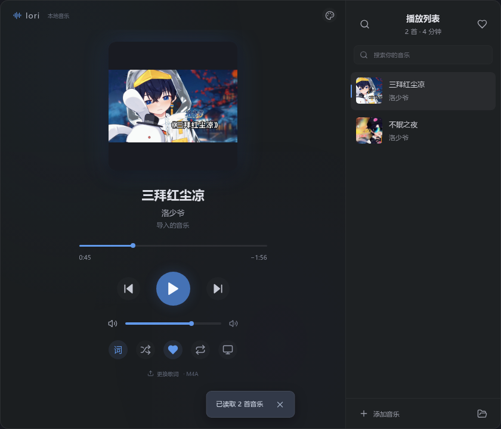
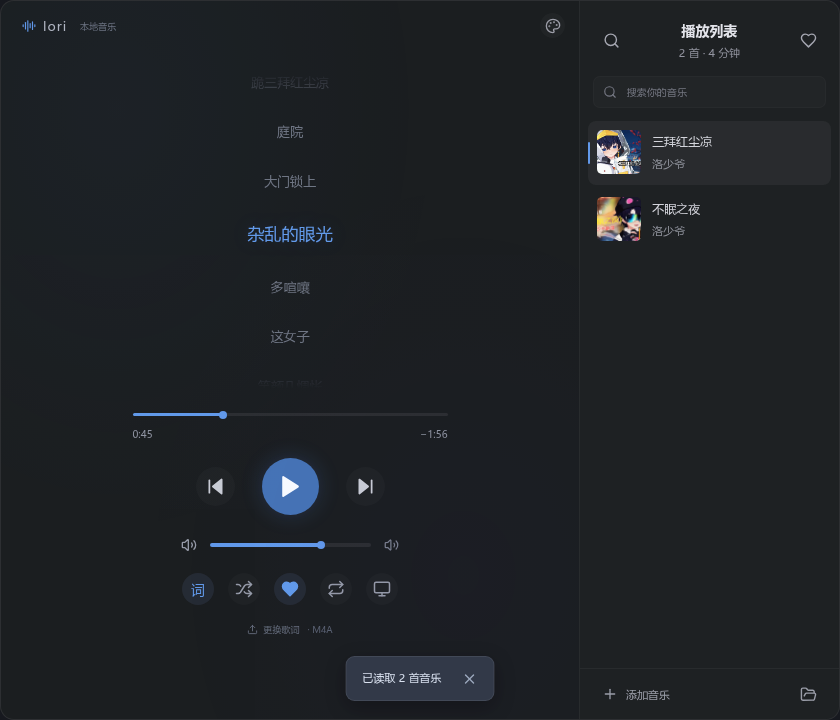

# Lori Player

**A quiet home for your local music.**

A compact desktop music player built with Tauri 2 and React: cover art or synced lyrics on the left, your playlist on the right. Everything stays on your machine — no account, no network requests, and your audio files are never moved, renamed, or rewritten.

[English](README.md) · [简体中文](README.zh-CN.md)


<p align="center">
  
  
</p>
<p align="center">
  
</p>

## Features

- **Your files stay yours.** Use the folder button to choose music files or recursively import a folder. Nothing is moved, copied, or retagged; removing a track from the library deletes nothing from disk.
- **Metadata that is already there.** Title, artist, and embedded cover art are read from the tags; lyrics come from a sibling `.lrc` file first, then from embedded lyrics, and can also be attached by hand.
- **Full playback control.** Play/pause, previous/next, seek by dragging, volume, shuffle, and repeat-one. Space toggles playback.
- **Lyrics that follow the music.** Switch the left pane between cover art and synced lyrics, and click any line to jump to that moment.
- **Desktop lyrics overlay.** A frameless, always-on-top, fully transparent window that shows one line at a time with a blue-white gradient and a soft shimmer. Lines slide in and out on change, the shimmer pauses with the music, and the overlay is click-through by default so it never blocks the window underneath. It hides itself while the current track has no lyrics.
- **Themes.** Misty blue by default, follow the cover art, sample a color from a wallpaper, a neon breathing effect, plus adjustable window opacity.
- **Library tools.** Favorites with a heart filter, and search across title, artist, album, and folder.
- **Listening statistics.** The playlist footer opens date filters, song rankings, daily totals, and interval history. Import and export JSON ledgers with automatic merging.
- **Local persistence.** Library, favorites, volume, theme, and manually attached lyrics are stored locally — IndexedDB in the browser preview, the app config directory on desktop. The web build keeps file copies; the desktop build keeps original paths.

## Listening ledger

Statistics start with actual playback after this update; existing library durations and recent-track lists do not become listening history. Songs are identified by the **MD5 of the complete original file**. Names, titles, and artists are labels only. Renaming a file preserves its identity; changing its contents, including tags, changes the hash. Removing a library item keeps its history.

Playback uses monotonic elapsed time with advancing media position as evidence. Pauses, buffering, and skipped positions are excluded; playback speed does not multiply listening time, and muted playback still counts. Sleep, clock jumps, and sampling gaps longer than five seconds are not extrapolated. Records span at most 60 seconds, with a checkpoint every second and a flush on pause, track change, and normal desktop close. A crash restores the last committed checkpoint, usually losing at most about one second; a long freeze can lose more unobserved time. Save failures remain visible and retry automatically.

Both builds use the dedicated `lori-listening-ledger` IndexedDB database (desktop: WebView application data). Time and song/time indexes support range queries and paginated history. An invalidatable in-memory prefix cache avoids rescanning settled history during live updates. Every total is derived from the ledger; there is no independent accumulated counter.

Total duration unions all intervals in the selected range, while song totals union intervals for each MD5. Simultaneous playback of different songs on multiple devices can make the sum of song durations exceed the overall total. Daily buckets follow the viewing device's local timezone; records use UTC milliseconds and half-open intervals.

Export always includes the full ledger. Import merges atomically, keeps the longer checkpoint for an existing ID, and never replaces existing history. Repeated imports and overlapping intervals do not inflate totals. Conflicting identity or labels under the same record ID abort the entire import. Multiple files can be merged separately. See the [ledger format](docs/listening-ledger.md).

## Requirements

- Node.js 18+ and npm
- A Rust toolchain (stable)
- Tauri 2 platform prerequisites — on Linux that means GTK 3 and WebKitGTK 4.1
- **FFmpeg** — bundled in the Windows installer; Linux/macOS need `ffmpeg` and `ffprobe` on `PATH` for desktop audio decoding

## Getting started

```bash
npm install

npm run desktop   # run the Tauri desktop app
npm run dev       # browser preview at http://localhost:1420
```

The browser preview imports music through the file picker or drag and drop. The desktop lyrics overlay is only available in the desktop build.

## System tray

The main window's × button and Alt+F4 hide the window while music and desktop lyrics continue running. Choose **显示播放器** (Show player) from the tray menu to restore it, or **退出播放器** (Quit player) to exit completely. Launching Lori again from the application menu or command line restores the existing instance.

Linux uses the desktop's StatusNotifier/AppIndicator tray. On Windows/macOS, a left click on the tray icon also restores the player.

## Desktop audio compatibility

WebKitGTK decodes some AAC and fragmented M4A streams differently from Chromium, which breaks seeking. The desktop build therefore uses FFmpeg locally to render a PCM WAV cache and plays it through a Blob created over binary IPC, so seeking behaves normally. The original files are untouched and no network access is involved. The cache lives in the app cache directory under `decoded-audio-v1`, evicts old entries automatically, and is capped at roughly 512 MiB. The currently playing decoded track is held in memory.

## Desktop lyrics overlay

The overlay is a transparent single-line window with clear blue-white gradient text and a moving shimmer rather than time-based coloring. When the line changes, the old one slides up and out while the new one slides in from below; the shimmer stops while playback is paused and is disabled entirely under "reduce motion". It has no toolbar, background card, blur, or window shadow — all management lives in the main player.

The overlay only appears when there is a lyric to read: with no lyric for the current track (or nothing selected) it hides itself and floats back as soon as a track with lyrics starts, so placeholder lines never sit on the desktop. Opening desktop lyrics while nothing has lyrics keeps the window on standby and the main player explains why it is not visible.

The main player's monitor button opens a menu where you can nudge the overlay into place ("Adjust position"), re-enable **click-through**, or close the overlay; every time it is reopened it starts click-through again.

The overlay remembers where you put it: the position is written to `lyrics-position.txt` in the app config directory as you drag, and restored on the next launch. Restored positions are checked against the currently connected monitors, so unplugging a second display never leaves the lyrics stranded off-screen.

GNOME Wayland does not honor keep-above requests for ordinary windows, so on Linux the app automatically selects the X11 backend when XWayland is available and `GDK_BACKEND` is not set explicitly — that is what keeps the lyrics on top and visible across workspaces. Native Wayland-only sessions remain limited by the compositor. Switching backends requires restarting the whole app.

## Tech stack

| Layer | Choice |
| --- | --- |
| Shell | Tauri 2 (`do.lori.player`), Rust backend |
| Frontend | React 19 + TypeScript, Vite |
| Icons | lucide-react |
| Tags (desktop) | [lofty](https://crates.io/crates/lofty) |
| Tags (web) | [music-metadata](https://www.npmjs.com/package/music-metadata) |
| Folder scan | [walkdir](https://crates.io/crates/walkdir) |
| Web persistence | [idb-keyval](https://www.npmjs.com/package/idb-keyval) |
| Decoding | FFmpeg subprocess (desktop) |

```
src/                  React UI, lyrics/LRC parsing, theme extraction
  library.ts          Track model, LRC parsing, active-line lookup, merge
  theme.ts            Dominant-hue extraction from cover art or wallpaper
  main.tsx            Player shell, playlist, overlay window, IPC
tests/                Playwright browser specs
src-tauri/src/lib.rs  Tauri commands: import, load_audio, overlay window
src-tauri/gen/        Tauri-generated ACL schemas
docs/screenshots/     Screenshots used by this README
```

## Testing

```bash
npm test                     # Library, theme, ledger algebra, and playback accounting tests
npm run build                # TypeScript check + production frontend build
cargo check --manifest-path src-tauri/Cargo.toml

# Rust unit tests, including the real-sample test
LORI_TEST_MUSIC_DIR=/path/to/audio cargo test \
  --manifest-path src-tauri/Cargo.toml -- --ignored --nocapture

# Playwright browser specs (uses an installed Google Chrome)
LORI_SAMPLE_DIR=/path/to/audio npm run test:browser
```

Statistics browser tests generate their own WAV and exercise real playback, MD5 identity, pause/seek boundaries, import/export, and persistence. The original real-library browser spec and ignored Rust test still require an external sample directory.

## Packaging

```bash
npm run tauri build
```

On Linux the bundle targets are deb and AppImage, and the deb declares a dependency on FFmpeg. Windows installers are built in GitHub Actions with FFmpeg included (see below). To run the built Linux binary from your own account, install it and add a launcher, for example:

```bash
install -Dm755 src-tauri/target/release/lori-player ~/.local/bin/lori-player
```

## License

[MIT](LICENSE) © 2026 AliyahZombie

## Credits

Built on [Tauri](https://tauri.app/), [React](https://react.dev/), [Vite](https://vite.dev/), [lucide](https://lucide.dev/), [lofty](https://crates.io/crates/lofty), [music-metadata](https://www.npmjs.com/package/music-metadata), [walkdir](https://crates.io/crates/walkdir) and [FFmpeg](https://ffmpeg.org/). Thank you to the maintainers of all of them.

在桌面歌词菜单的「调整位置」模式中，可以实时调整文字大小（18–56 px）和不透明度（20%–100%），设置自动保存。窗口高度随字号适配，保持紧凑；「恢复默认」返回 34 px、100% 不透明度。

## Windows builds

Windows x64 NSIS installers are built by [GitHub Actions](https://github.com/AliyahZombie/lori-player/actions/workflows/windows.yml). Download the `Lori-Player-windows-x64-<commit>` artifact from a successful run. FFmpeg is bundled; WebView2 is installed online if missing. No local Windows build environment is required. These are unsigned CI builds. See [Windows build and verification notes](docs/windows.md) for details and remaining desktop acceptance checks.
